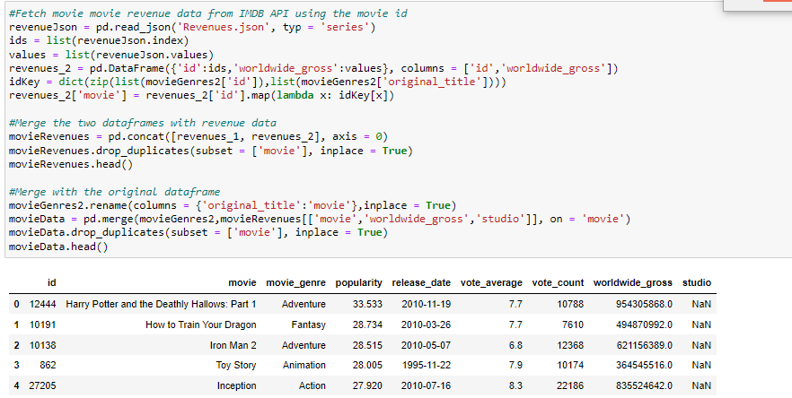

# Phase 1 Project

## Project Overview

This project aims to analyze box office movie data and come up with useful insights which can be used as recommendations for Microsoft that is seeking to start its own movie production studio.

### Business Problem

Microsoft sees all the big companies creating original video content and they want to get in on the fun. They have decided to create a new movie studio, but they don’t know anything about creating movies. You are charged with exploring what types of films are currently doing the best at the box office. You must then translate those findings into actionable insights that the head of Microsoft's new movie studio can use to help decide what type of films to create.

### Data Sources

The datasets used for this analysis are sourced from imdb , rotten tomatoes. This project also employs use of the IMDB Api to fetch data that was either missing or not available in the datasets.

 ### Data Understanding and Preparation
 1. Loading the data using pandas.
 2. Exploring the data in each dataset and what they each represent.
 3. Cleaning data by dropping duplicates, converting colmns to the correct datatypes.
4. Handling missing values by either dropping rows or using other datasources to fill the missing values.
 3. Merging datasets with similar data.
 

### Data Analysis and Findings

Sourcing data from IMDB API

Movie distribution by genre

Movie Ratings

### Conclusions / Insights

1. Movie's genre has a high influence on its popularity which results in high revenue generation. Some genres are more popular than others resulting in such genres performing better at the box office.

<a href="https://github.com/AmanyaKaren/dsc-phase-1-project/blob/master/student.ipynb">See full findings <a>